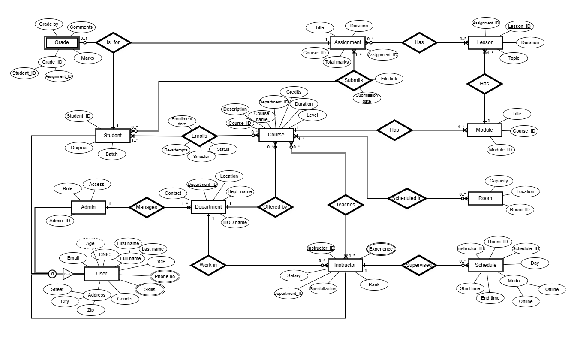

# Smart Course Registration System – 2nd Semester Database Project

This is a simple SQL-based project built for the 2nd semester DBMS course. It models a basic university course registration system and includes:

- Tables for students, instructors, modules, lessons, and assignments
- Sample data insertion scripts
- An ERD showing entity relationships

## ERD Diagram

## Files Included

- `create_tables.sql` – SQL script to create all tables  
- `insert_data.sql` – Script to insert sample records
